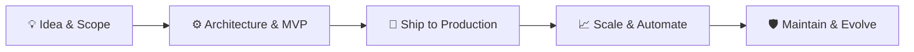

  <!-- HERO BANNER / HEADER -->
  

   

  <!-- SOCIAL / BADGES BAR -->
  
  
  
  

    

  <!-- PUNCHY ELEVATOR PITCH -->
  

    <strong>I design, ship, and scale AI-powered products.</strong> 
    Bridging product thinking with deep full-stack engineering, agentic AI workflows, and resilient backend systems.
  

  

    <code>Idea</code> ➔ <code>Prototype</code> ➔ <code>Ship</code> ➔ <code>Scale</code> ➔ <code>Maintain</code>
  

---

### ⚡ At a Glance

- 🔭 **Currently Building:** Production-ready AI agent workflows and scalable full-stack applications.
- 💡 **Specialties:** Full product lifecycle, REST backend architectures, mobile/web apps, and LLM orchestration.
- 🧠 **Exploring / Deepening:** LangGraph, advanced RAG architectures, Kubernetes, and Cloud Infrastructure.
- 💬 **Ask me about:** Python, FastAPI, React/React Native, Node.js, Ollama, and shipping MVPs fast.

---

### 🧱 Engineering Philosophy: The Builder Flow

> *"Software is only as good as the problem it solves. I build for reliability, modular depth, and real-world user adoption."*

---

### 🚀 Featured Products & Systems

Here are selected systems and applications showcasing end-to-end architecture:

<table>
  <tr>
    <td width="50%" valign="top">
      <h3 align="center">🤖 Agentic AI Workflow Platform</h3>
      
An orchestration engine running local & cloud LLMs to automate multi-step research and data pipelines.

      <ul>
        <li><b>Stack:</b> Python, FastAPI, Ollama, LangChain, Docker</li>
        <li><b>Key Feature:</b> Resilient tool-calling agents with structured JSON outputs and streaming APIs.</li>
      </ul>
      

        <a href="https://github.com/raindotdev"><b>View Code ↗</b></a> &nbsp;|&nbsp; 
        <a href="https://github.com/raindotdev"><b>Live Demo ↗</b></a>
      

    </td>
    <td width="50%" valign="top">
      <h3 align="center">💼 Full-Stack AI SaaS Platform</h3>
      
A production web platform built from scratch with billing, auth, and automated workflow triggers.

      <ul>
        <li><b>Stack:</b> React, Node.js / TypeScript, Firebase, Razorpay</li>
        <li><b>Key Feature:</b> Multi-tenant auth, webhook-driven subscription billing, and real-time dashboard.</li>
      </ul>
      

        <a href="https://github.com/raindotdev"><b>View Code ↗</b></a> &nbsp;|&nbsp; 
        <a href="https://github.com/raindotdev"><b>Live Demo ↗</b></a>
      

    </td>
  </tr>
  <tr>
    <td colspan="2" valign="top">
      <h3 align="center">📱 Cross-Platform Mobile Application</h3>
      
A high-performance mobile companion app integrated with cloud backends and real-time offline synchronization.

      <ul>
        <li><b>Stack:</b> React Native, TypeScript, Fastify, Linux / Docker</li>
        <li><b>Key Feature:</b> Native performance, seamless third-party API integrations, and intuitive UX design.</li>
      </ul>
      

        <a href="https://github.com/raindotdev"><b>View Code ↗</b></a> &nbsp;|&nbsp; 
        <a href="https://github.com/raindotdev"><b>Live Demo ↗</b></a>
      

    </td>
  </tr>
</table>

---

### 🛠️ Core Stack & Technical Toolbox

#### 💻 Core Development

  
  
  
  
  
  
  

#### ⚙️ Backend, Integrations & Databases

  
  
  
  

#### 🧠 AI & Agentic Development

  
  
  
  

#### 🚢 DevOps, Systems & Tooling

  
  
  
  

#### 🔬 Currently Exploring / Deepening
<code>LangGraph</code> • <code>Advanced RAG</code> • <code>Kubernetes</code> • <code>Terraform</code> • <code>AWS Cloud Architecture</code>

---

### 📊 GitHub Activity & Metrics

  
  

    

  

---

### 🤝 Let's Connect & Collaborate

Whether you want to discuss a new product idea, collaborate on agentic AI tooling, or chat about scalable backends:

- 💼 **LinkedIn:** [Connect with me](https://linkedin.com/in/raindotdev)
- 🐦 **X / Twitter:** [@raindotdev](https://twitter.com/raindotdev)
- 📬 **Email:** [contact@raindotdev.com](mailto:contact@raindotdev.com)
- 🌐 **GitHub:** [github.com/raindotdev](https://github.com/raindotdev)

  Designed with ❤️ by a Product Engineer who loves shipping things that matter.

